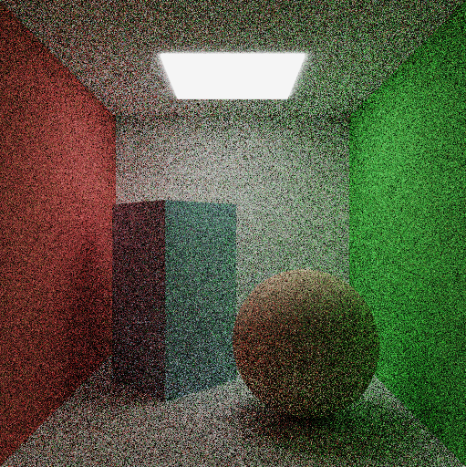
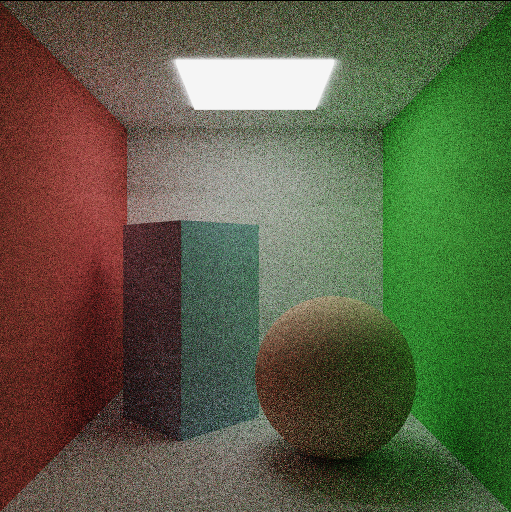

# raytracing-course

## Monte-Carlo integration

64 samples              |  256 samples              | 1024 samples
:----------------------:|:-------------------------:|:--------------------------------------:
|   | 

### Build

```bash
./build.sh
```

### Run

```bash
./run.sh <path-to-scene-file> <path-to-output-image-file> [-v] [-thread]
```

Flags:
- `-v` -- verbosity flag -- raytracer prints scene config
- `-thread` -- multithread -- raytracer runs milti-threaded version of `engine::generate_image` function 
(approx. 3x speed-up on my Intel i5 12500H with 12 cores and 16 threads).
