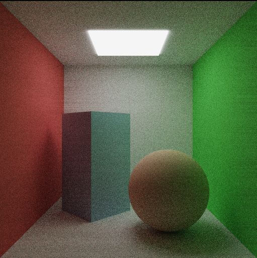
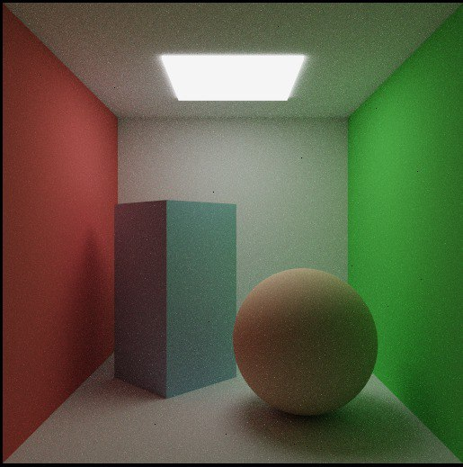

# raytracing-course

### Multiple importance sampling (MIS)

Monte-Carlo integration 1024 samples |  MIS 1024 samples
:----------------------:|:-------------------------:
|  

### Build

```bash
./build.sh
```

### Run

```bash
./run.sh <path-to-scene-file> <path-to-output-image-file>
```
